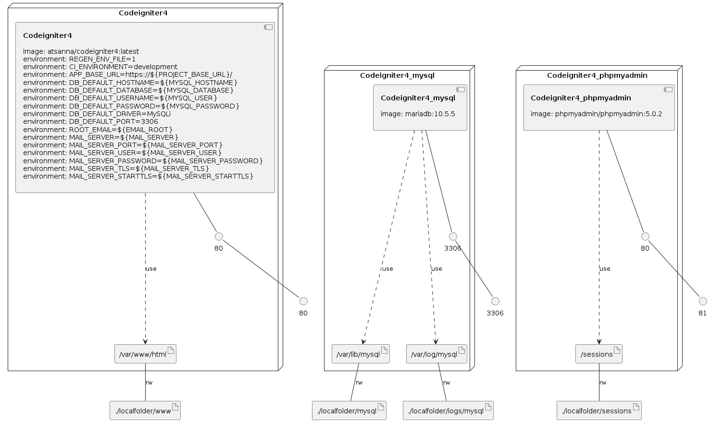

## Docker Image for CodeIgniter4 development
[](https://hub.docker.com/r/atsanna/codeigniter4/)
[](https://hub.docker.com/r/atsanna/codeigniter4/)
[](https://hub.docker.com/r/atsanna/codeigniter4/)
[](https://hub.docker.com/r/atsanna/codeigniter4/)
[](https://hub.docker.com/r/atsanna/codeigniter4/)

This repository provides you a development environment without requiring you to install PHP, a web server, and any other server software on your local machine. For this, it requires Docker and Docker Compose.

Basic example to create your container (tested on Ubuntu 20.04 - Docker version 20.10.11, build dea9396 - docker-compose version 1.25.0 ):

**NOTE: This package is under early development and is not ready for prime-time.**

**The old version is still available in the branch called "old"**

## Build Image

Clone thi repository and run:
```
./build.sh
```

start the container with php 7.4:
```
docker container run -it --publish 80:80 --name ci4 -v /localfolder:/var/www/html codeigniter4.2.3:7.4.30-apache
```

start the container with php 8.0:
```
docker container run -it --publish 80:80 --name ci4 -v /localfolder:/var/www/html codeigniter4.2.3:8.0.20-apache
```

start the container with php 8.1:
```
docker container run -it --publish 80:80 --name ci4 -v /localfolder:/var/www/html codeigniter4.2.3:8.1.9-apache
```

## Installation

1. Install [docker](https://docs.docker.com/engine/installation/) and [docker-compose](https://docs.docker.com/compose/install/) ;

2. Copy `docker-compose.yml` file to your project root path, and edit it according to your needs ;

3. Uncomment, in the `docker-compose.yml` file, the image you want to use it ;

4. From your project directory, start up your application by running:

```sh
docker-compose up -d
```

4. From your project directory, stop your application by running:

```sh
docker-compose down --volumes
```

# Environment variables summary:

## Environment file
### allowed values are: [`0`, `1`]
- `REGEN_ENV_FILE` - if 1, the `.env` file will be created and overwritten when the container starts

## App Configuration
- `CI_ENVIRONMENT` - ENVIRONMENT [`production`, `develompent`, `tests`]
- `APP_BASE_URL` - URL to your CodeIgniter root. Typically this will be your base URL, WITH a trailing slash [`http://localhost/`]
- `APP_FORCE_GLOBAl_SECURE_REQUESTS` - If true, this will force every request made to this application to be made via a secure connection (HTTPS) [`true`, `false`]


## App Session
- `APP_SESSION_DRIVER` - [`CodeIgniter\Session\Handlers\FileHandler`]
- `APP_SESSION_COOCKIE_NAME` - [`ci_session`]
- `APP_SESSION_EXPIRATION` - [`7200`]
- `APP_SESSION_SAVE_PATH` - [`null`]
- `APP_SESSION_MATCH_CHIP` - [`true`, `false`]
- `APP_SESSION_TIME_TO_UPDATE` - [`300`]
- `APP_SESSION_REGENERATE_DESTROY` - [`true`, `false`]
- `APP_CSP_ENABLED` - [`true`, `false`]

## Default Database Configuration
- `DB_DEFAULT_HOSTNAME` - default hostname [`127.0.0.1`]
- `DB_DEFAULT_DATABASE` - default database name
- `DB_DEFAULT_USERNAME` - default database username
- `DB_DEFAULT_PASSWORD` - default database password
- `DB_DEFAULT_DRIVER` - default database driver [`MySQLi`, `SQLSRV`, `Postgre`, `OCI8`, `SQLite3`]
- `DB_DEFAULT_PORT` - default database port [`3306`, `1443`, `5432`, `1521`]
- `DB_DEFAULT_PREFIX` - default database prefix

## Tests Database Configuration
- `DB_TESTS_HOSTNAME` - tests hostname [`127.0.0.1`]
- `DB_TESTS_DATABASE` - tests database name
- `DB_TESTS_USERNAME` - tests database username
- `DB_TESTS_PASSWORD` - tests database password
- `DB_TESTS_DRIVER` - tests database driver [`MySQLi`, `SQLSRV`, `Postgre`, `OCI8`, `SQLite3`]
- `DB_TESTS_PORT` - tests database port [`3306`, `1443`, `5432`, `1521`]
- `DB_TESTS_PREFIX` - tests database prefix

- `DB_DEFAULT_PREFIX` - default database prefix

## Content Secure Policy Configuration
- `CONTENT_SECURE_POLICY_REPORT_ONLY` - Default CSP report context [`true`, `false`]
- `CONTENT_SECURE_POLICY_DEFAULT_SRC` - Will default to self if not overridden [`none`]
- `CONTENT_SECURE_POLICY_SCRIPT_SRC` - Lists allowed scripts' URLs [`self`]
- `CONTENT_SECURE_POLICY_STYLE_SRC` - Lists allowed stylesheets' URLs [`self`]
- `CONTENT_SECURE_POLICY_IMAGE_SRC` - Defines the origins from which images can be loaded [`self`]
- `CONTENT_SECURE_POLICY_BASE_URI` - Restricts the URLs that can appear in a page's `<base>` element [`null`]
- `CONTENT_SECURE_POLICY_CHILD_SRC` - Lists the URLs for workers and embedded frame contents [`null`]
- `CONTENT_SECURE_POLICY_CONNECT_SRC` - Limits the origins that you can connect to (via XHR, WebSockets, and EventSource)[`self`]
- `CONTENT_SECURE_POLICY_FONT_SRC` - Specifies the origins that can serve web fonts [`null`]
- `CONTENT_SECURE_POLICY_FORM_ACTION` - Lists valid endpoints for submission from `<form>` tags [`null`]
- `CONTENT_SECURE_POLICY_FRAME_ANCESTORS` - Specifies the sources that can embed the current page [`null`]
- `CONTENT_SECURE_POLICY_RFAME_SRC` - The frame-src directive restricts the URLs which may be loaded into nested browsing contexts [`null`]
- `CONTENT_SECURE_POLICY_MEDIA_SRC` - Restricts the origins allowed to deliver video and audio [`null`]
- `CONTENT_SECURE_POLICY_OBJECT_SRC` - Allows control over Flash and other plugins [`null`]
- `CONTENT_SECURE_POLICY_PLUGIN_TYPES` - Limits the kinds of plugins a page may invoke [`null`]
- `CONTENT_SECURE_POLICY_REPORT_URI` - Specifies a URL where a browser will send reports when a content security policy is violated [`null`]
- `CONTENT_SECURE_POLICY_SANDBOX` - List of actions allowed [`true`, `false`]
- `CONTENT_SECURE_POLICY_UPGRADE_INSECURE_REQUESTS` - Instructs user agents to rewrite URL schemes, changing  HTTP to HTTPS. This directive is for websites with large numbers of old URLs that need to be rewritten[`true`, `false`]

## Cookie Configuration
- `COOKIE_PREFIX` - Set a cookie name prefix if you need to avoid collisions [``]
- `COOKIE_EXPIRES` - Default expires timestamp for cookies [`0`]
- `COOKIE_PATH` - Typically will be a forward slash [`/`]
- `COOKIE_DOMAIN` - Set to `.your-domain.com` for site-wide cookies [``]
- `COOKIE_SECURE` - Cookie will only be set if a secure HTTPS connection exists [`true`, `false`]
- `COOKIE_HTTP_ONLY` - Cookie will only be accessible via HTTP(S) (no JavaScript) [`true`, `false`]
- `COOKIE_SAME_SITE` - Configure cookie SameSite setting [`None`, `Lax`, `Strict`, `''`]
- `COOKIE_RAW` - This flag allows setting a "raw" cookie [`true`, `false`]

## Encryption Configuration
- `ENCRYPTION_KEY` - If you use the Encryption class you must set an encryption key (seed) [``]
- `ENCRYPTION_DRIVER` - One of the supported encryption drivers [`OpenSSL`, `Sodium`]
- `ENCRYPTION_BLOCK_SIZE` - This is the number of bytes that will be padded to the plaintext message before it is encrypted [`16`]
- `ENCRYPTION_DIGEST` - HMAC digest to use [`SHA256`, `SHA512`]

## Honeypot Configuration
- `HONEYPOT_HIDDEN` - Makes Honeypot visible or not to human [`true`, `false`]
- `HONEYPOT_LABEL` - Honeypot Label Content [`Fill This Field`]
- `HONEYPOT_NAME` - Honeypot Field Name [`honeypot`]
- `HONEYPOT_TEMPLATE` - Honeypot HTML Template [`<label>{label}</label><input type="text" name="{name}" value=""/>`]
- `HONEYPOT_CONTAINER` - Honeypot container [`<div style="display:none">{template}</div>`]

## Security Configuration
- `SECURITY_CSRF_PROTECTION` - Protection Method for Cross Site Request Forgery protection [`cookie`, `session`]
- `SECURITY_TOKEN_RANDOMIZE` - Randomize the CSRF Token for added security [`true`, `false`]
- `SECURITY_TOKEN_NAME` - Token name for Cross Site Request Forgery protection [`csrf_token_name`]
- `SECURITY_HEADER_NAME` - Header name for Cross Site Request Forgery protection [`X-CSRF-TOKE`]
- `SECURITY_COOKIE_NAME` - Cookie name for Cross Site Request Forgery protection [`csrf_cookie_name`]
- `SECURITY_EXPIRES` - Expiration time for Cross Site Request Forgery protection cookie [`7200`]
- `SECURITY_REGENERATE` - Regenerate CSRF Token on every submission [`true`, `false`]
- `SECURITY_REDIRECT` - Redirect to previous page with error on failure [`true`, `false`]
- `SECURITY_SAME_SITE` - Setting for CSRF SameSite cookie token [`None`, `Lax`, `Strict`, `''`]

## Logger Configuration
- `LOGGER_THRESHOLD` - You can enable error logging by setting a threshold over zero [`0`, `1`, `2`, `3`, `4`, `5`, `6`, `7`, `8`, `9`]
    - Threshold options are:
        * 0 = Disables logging, Error logging TURNED OFF
        * 1 = Emergency Messages - System is unusable
        * 2 = Alert Messages - Action Must Be Taken Immediately
        * 3 = Critical Messages - Application component unavailable, unexpected exception.
        * 4 = Runtime Errors - Don't need immediate action, but should be monitored.
        * 5 = Warnings - Exceptional occurrences that are not errors.
        * 6 = Notices - Normal but significant events.
        * 7 = Info - Interesting events, like user logging in, etc.
        * 8 = Debug - Detailed debug information.
        * 9 = All Messages

## Curl Request Configuration
- `CURL_REQUEST_SHARE_OPTIONS` - Whether share options between requests or not [`true`, `false`]

## Sendmail Configuration
- `ROOT_EMAIL` - The user that gets all mail for userids less than 1000. Ifblank, address rewriting is disabled.
- `MAIL_SERVER` - The host to send mail to, in the form host.
- `MAIL_SERVER_PORT` - The port to send mail to, in the form host.
- `MAIL_SERVER_USER` - The user name to use for SMTP AUTH.
- `MAIL_SERVER_PASSWORD` - The password to use for SMTP AUTH.
- `MAIL_SERVER_TLS` - Specifies whether ssmtp uses TLS to talk to the SMTP server.
- `MAIL_SERVER_STARTTLS` - Specifies whether ssmtp does a EHLO/STARTTLS before starting SSL negotiation.

## List of Apache Modules pre-installed on these Docker images (apachectl -M)

- `core_module` (static)
- `so_module` (static)
- `watchdog_module` (static)
- `http_module` (static)
- `log_config_module` (static)
- `logio_module` (static)
- `version_module` (static)
- `unixd_module` (static)
- `access_compat_module` (shared)
- `alias_module` (shared)
- `auth_basic_module` (shared)
- `authn_core_module` (shared)
- `authn_file_module` (shared)
- `authz_core_module` (shared)
- `authz_host_module` (shared)
- `authz_user_module` (shared)
- `autoindex_module` (shared)
- `cgi_module` (shared)
- `deflate_module` (shared)
- `dir_module` (shared)
- `env_module` (shared)
- `expires_module` (shared)
- `fcgid_module` (shared)
- `filter_module` (shared)
- `headers_module` (shared)
- `mime_module` (shared)
- `mpm_prefork_module` (shared)
- `negotiation_module` (shared)
- `php_module` (shared)
- `proxy_module` (shared)
- `proxy_http_module` (shared)
- `reqtimeout_module` (shared)
- `rwrite_module` (shared)
- `setenvif_module` (shared)
- `socache_shmcb_module` (shared)
- `ssl_module` (shared)
- `status_module` (shared)


## List of PHP Modules pre-installed on these Docker images (php -m)

[PHP Modules]
- `amqp`
- `ast`
- `bcmath`
- `bz2`
- `calendar`
- `Core`
- `csv`
- `ctype`
- `curl`
- `date`
- `dba`
- `decimal`
- `dom`
- `ds`
- `enchant`
- `ev`
- `event`
- `excimer`
- `exif`
- `FFI`
- `fileinfo`
- `filter`
- `ftp`
- `gd`
- `geospatial`
- `gettext`
- `gmp`
- `gnupg`
- `grpc`
- `hash`
- `http`
- `iconv`
- `igbinary`
- `imagick`
- `imap`
- `inotify`
- `intl`
- `json`
- `json_post`
- `ldap`
- `libsmbclient`
- `libxml`
- `lzf`
- `mailparse`
- `maxminddb`
- `mbstring`
- `mcrypt`
- `memcache`
- `memcached`
- `mongodb`
- `msgpack`
- `mysqli`
- `mysqlnd`
- `OAuth`
- `oci8`
- `odbc`
- `opencensus`
- `openssl`
- `openswoole`
- `pcntl`
- `pcov`
- `pcre`
- `PDO`
- `pdo_dblib`
- `PDO_Firebird`
- `pdo_mysql`
- `PDO_OCI`
- `PDO_ODBC`
- `pdo_pgsql`
- `pdo_sqlite`
- `pdo_sqlsrv`
- `pgsql`
- `Phar`
- `posix`
- `pspell`
- `raphf`
- `readline`
- `redis`
- `Reflection`
- `SeasLog`
- `session`
- `shmop`
- `SimpleXML`
- `smbclient`
- `snmp`
- `soap`
- `sockets`
- `sodium`
- `SPL`
- `sqlite3`
- `sqlsrv`
- `ssh2`
- `standard`
- `tokenizer`
- `uuid`
- `xdebug`
- `xml`
- `xmldiff`
- `xmlreader`
- `xmlrpc`
- `xmlwriter`
- `xsl`
- `yac`
- `yaml`
- `yar`
- `Zend OPcache`
- `zend_test`
- `zephir_parser`
- `zip`
- `zlib`
- `zstd`

[Zend Modules]
- `Xdebug`
- `Zend OPcache`

## Changelog

You can find the changes made in the [changelog](CHANGELOG.md) file 

## Contributing

Contributions are welcome!
Leave an issue on Github, or create a Pull Request.

## Licence

This work is under [MIT](LICENSE) licence.


### Infrastructure model

